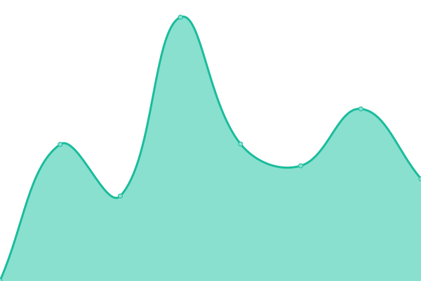
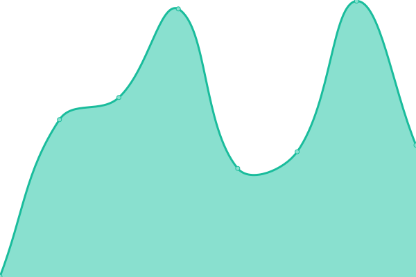
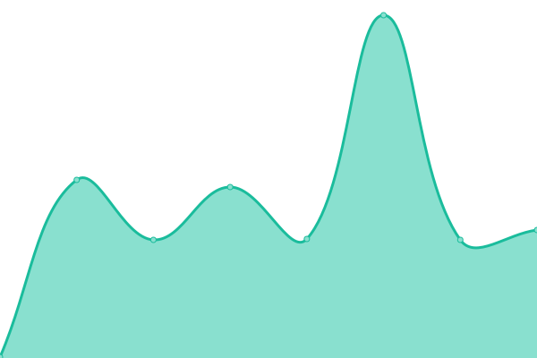
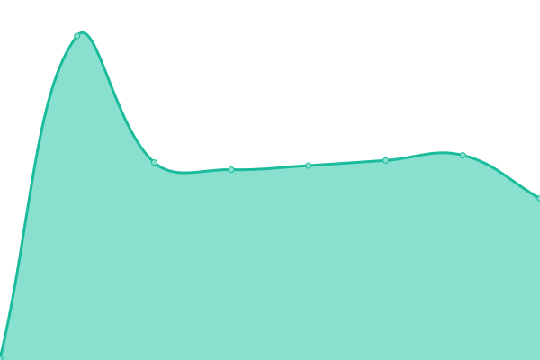
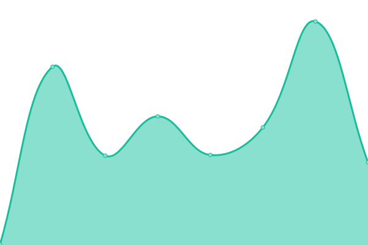
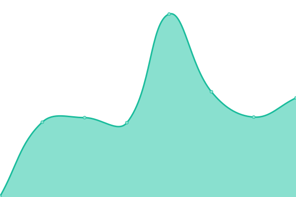
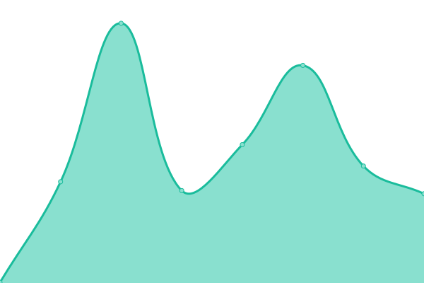
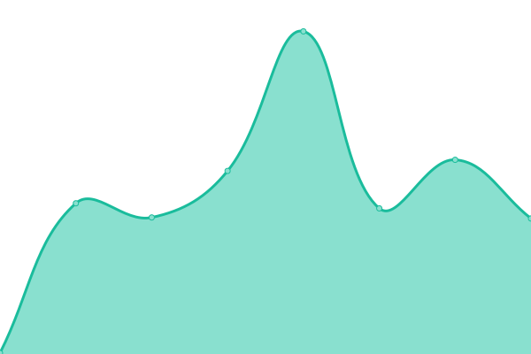

# [📈 Live Status](https://503stack.xyz/uptimetest): <!--live status--> **🟩 All systems operational**

This repository contains the open-source uptime monitor and status page for [503stack](https://503stack.xyz/uptimetest), powered by [Upptime](https://github.com/upptime/upptime).

With [Upptime](https://upptime.js.org), you can get your own unlimited and free uptime monitor and status page, powered entirely by a GitHub repository. We use [Issues](https://github.com/503stack/uptimetest/issues) as incident reports, [Actions](https://github.com/503stack/uptimetest/actions) as uptime monitors, and [Pages](https://503stack.xyz) for the status page.

<!--start: status pages-->
<!-- This summary is generated by Upptime (https://github.com/upptime/upptime) -->
<!-- Do not edit this manually, your changes will be overwritten -->
<!-- prettier-ignore -->
| URL | Status | History | Response Time | Uptime |
| --- | ------ | ------- | ------------- | ------ |
|  [brg-tt02-aks](https://brg.apps.tt02.altinn.no/kuberneteswrapper/api/v1/deployments) | 🟩 Up | [brg-tt02-aks.yml](https://github.com/503stack/uptimetest/commits/HEAD/history/brg-tt02-aks.yml) | 

 464ms
     
 | 

<a href="https://503stack.xyz/history/brg-tt02-aks">100.00%</a>
    

|  [buf-tt02-aks](https://buf.apps.tt02.altinn.no/kuberneteswrapper/api/v1/deployments) | 🟩 Up | [buf-tt02-aks.yml](https://github.com/503stack/uptimetest/commits/HEAD/history/buf-tt02-aks.yml) | 

 457ms
     
 | 

<a href="https://503stack.xyz/history/buf-tt02-aks">100.00%</a>
    

|  [dat-tt02-aks](https://dat.apps.tt02.altinn.no/kuberneteswrapper/api/v1/deployments) | 🟩 Up | [dat-tt02-aks.yml](https://github.com/503stack/uptimetest/commits/HEAD/history/dat-tt02-aks.yml) | 

 428ms
     
 | 

<a href="https://503stack.xyz/history/dat-tt02-aks">100.00%</a>
    

|  [dibk-tt02-aks](https://dibk.apps.tt02.altinn.no/kuberneteswrapper/api/v1/deployments) | 🟩 Up | [dibk-tt02-aks.yml](https://github.com/503stack/uptimetest/commits/HEAD/history/dibk-tt02-aks.yml) | 

 442ms
     
 | 

<a href="https://503stack.xyz/history/dibk-tt02-aks">100.00%</a>
    

|  [digdir-tt02-aks](https://digdir.apps.tt02.altinn.no/kuberneteswrapper/api/v1/deployments) | 🟩 Up | [digdir-tt02-aks.yml](https://github.com/503stack/uptimetest/commits/HEAD/history/digdir-tt02-aks.yml) | 

 434ms
     
 | 

<a href="https://503stack.xyz/history/digdir-tt02-aks">100.00%</a>
    

|  [dihe-tt02-aks](https://dihe.apps.tt02.altinn.no/kuberneteswrapper/api/v1/deployments) | 🟩 Up | [dihe-tt02-aks.yml](https://github.com/503stack/uptimetest/commits/HEAD/history/dihe-tt02-aks.yml) | 

 416ms
     
 | 

<a href="https://503stack.xyz/history/dihe-tt02-aks">100.00%</a>
    

|  [dmf-tt02-aks](https://dmf.apps.tt02.altinn.no/kuberneteswrapper/api/v1/deployments) | 🟩 Up | [dmf-tt02-aks.yml](https://github.com/503stack/uptimetest/commits/HEAD/history/dmf-tt02-aks.yml) | 

 380ms
     
 | 

<a href="https://503stack.xyz/history/dmf-tt02-aks">100.00%</a>
    

|  [din-tt02-aks](https://din.apps.tt02.altinn.no/kuberneteswrapper/api/v1/deployments) | 🟩 Up | [din-tt02-aks.yml](https://github.com/503stack/uptimetest/commits/HEAD/history/din-tt02-aks.yml) | 

 383ms
     
 | 

<a href="https://503stack.xyz/history/din-tt02-aks">100.00%</a>
    

|  [dsb-tt02-aks](https://dsb.apps.tt02.altinn.no/kuberneteswrapper/api/v1/deployments) | 🟩 Up | [dsb-tt02-aks.yml](https://github.com/503stack/uptimetest/commits/HEAD/history/dsb-tt02-aks.yml) | 

 385ms
     
 | 

<a href="https://503stack.xyz/history/dsb-tt02-aks">100.00%</a>
    

|  [fd-tt02-aks](https://fd.apps.tt02.altinn.no/kuberneteswrapper/api/v1/deployments) | 🟩 Up | [fd-tt02-aks.yml](https://github.com/503stack/uptimetest/commits/HEAD/history/fd-tt02-aks.yml) | 

 346ms
     
 | 

<a href="https://503stack.xyz/history/fd-tt02-aks">100.00%</a>
    

|  [fhi-tt02-aks](https://fhi.apps.tt02.altinn.no/kuberneteswrapper/api/v1/deployments) | 🟩 Up | [fhi-tt02-aks.yml](https://github.com/503stack/uptimetest/commits/HEAD/history/fhi-tt02-aks.yml) | 

 364ms
     
 | 

<a href="https://503stack.xyz/history/fhi-tt02-aks">100.00%</a>
    

|  [fors-tt02-aks](https://fors.apps.tt02.altinn.no/kuberneteswrapper/api/v1/deployments) | 🟩 Up | [fors-tt02-aks.yml](https://github.com/503stack/uptimetest/commits/HEAD/history/fors-tt02-aks.yml) | 

 337ms
     
 | 

<a href="https://503stack.xyz/history/fors-tt02-aks">100.00%</a>
    

|  [gk-tt02-aks](https://gk.apps.tt02.altinn.no/kuberneteswrapper/api/v1/deployments) | 🟩 Up | [gk-tt02-aks.yml](https://github.com/503stack/uptimetest/commits/HEAD/history/gk-tt02-aks.yml) | 

 350ms
     
 | 

<a href="https://503stack.xyz/history/gk-tt02-aks">100.00%</a>
    

|  [hdir-tt02-aks](https://hdir.apps.tt02.altinn.no/kuberneteswrapper/api/v1/deployments) | 🟩 Up | [hdir-tt02-aks.yml](https://github.com/503stack/uptimetest/commits/HEAD/history/hdir-tt02-aks.yml) | 

 361ms
     
 | 

<a href="https://503stack.xyz/history/hdir-tt02-aks">100.00%</a>
    

|  [hemit-tt02-aks](https://hemit.apps.tt02.altinn.no/kuberneteswrapper/api/v1/deployments) | 🟩 Up | [hemit-tt02-aks.yml](https://github.com/503stack/uptimetest/commits/HEAD/history/hemit-tt02-aks.yml) | 

 360ms
     
 | 

<a href="https://503stack.xyz/history/hemit-tt02-aks">100.00%</a>
    

|  [hi-tt02-aks](https://hi.apps.tt02.altinn.no/kuberneteswrapper/api/v1/deployments) | 🟩 Up | [hi-tt02-aks.yml](https://github.com/503stack/uptimetest/commits/HEAD/history/hi-tt02-aks.yml) | 

 333ms
     
 | 

<a href="https://503stack.xyz/history/hi-tt02-aks">100.00%</a>
    

|  [hmrhf-tt02-aks](https://hmrhf.apps.tt02.altinn.no/kuberneteswrapper/api/v1/deployments) | 🟩 Up | [hmrhf-tt02-aks.yml](https://github.com/503stack/uptimetest/commits/HEAD/history/hmrhf-tt02-aks.yml) | 

 339ms
     
 | 

<a href="https://503stack.xyz/history/hmrhf-tt02-aks">100.00%</a>
    

|  [ikta-tt02-aks](https://ikta.apps.tt02.altinn.no/kuberneteswrapper/api/v1/deployments) | 🟩 Up | [ikta-tt02-aks.yml](https://github.com/503stack/uptimetest/commits/HEAD/history/ikta-tt02-aks.yml) | 

 323ms
     
 | 

<a href="https://503stack.xyz/history/ikta-tt02-aks">100.00%</a>
    

|  [k1103-tt02-aks](https://k1103.apps.tt02.altinn.no/kuberneteswrapper/api/v1/deployments) | 🟩 Up | [k1103-tt02-aks.yml](https://github.com/503stack/uptimetest/commits/HEAD/history/k1103-tt02-aks.yml) | 

 358ms
     
 | 

<a href="https://503stack.xyz/history/k1103-tt02-aks">100.00%</a>
    

|  [krt-tt02-aks](https://krt.apps.tt02.altinn.no/kuberneteswrapper/api/v1/deployments) | 🟩 Up | [krt-tt02-aks.yml](https://github.com/503stack/uptimetest/commits/HEAD/history/krt-tt02-aks.yml) | 

 354ms
     
 | 

<a href="https://503stack.xyz/history/krt-tt02-aks">100.00%</a>
    

|  [ksdigi-tt02-aks](https://ksdigi.apps.tt02.altinn.no/kuberneteswrapper/api/v1/deployments) | 🟩 Up | [ksdigi-tt02-aks.yml](https://github.com/503stack/uptimetest/commits/HEAD/history/ksdigi-tt02-aks.yml) | 

 336ms
     
 | 

<a href="https://503stack.xyz/history/ksdigi-tt02-aks">100.00%</a>
    

|  [kv-tt02-aks](https://kv.apps.tt02.altinn.no/kuberneteswrapper/api/v1/deployments) | 🟩 Up | [kv-tt02-aks.yml](https://github.com/503stack/uptimetest/commits/HEAD/history/kv-tt02-aks.yml) | 

 332ms
     
 | 

<a href="https://503stack.xyz/history/kv-tt02-aks">100.00%</a>
    

|  [kyv-tt02-aks](https://kyv.apps.tt02.altinn.no/kuberneteswrapper/api/v1/deployments) | 🟩 Up | [kyv-tt02-aks.yml](https://github.com/503stack/uptimetest/commits/HEAD/history/kyv-tt02-aks.yml) | 

 367ms
     
 | 

<a href="https://503stack.xyz/history/kyv-tt02-aks">100.00%</a>
    

|  [lt-tt02-aks](https://lt.apps.tt02.altinn.no/kuberneteswrapper/api/v1/deployments) | 🟩 Up | [lt-tt02-aks.yml](https://github.com/503stack/uptimetest/commits/HEAD/history/lt-tt02-aks.yml) | 

 369ms
     
 | 

<a href="https://503stack.xyz/history/lt-tt02-aks">100.00%</a>
    

|  [lts-tt02-aks](https://lts.apps.tt02.altinn.no/kuberneteswrapper/api/v1/deployments) | 🟩 Up | [lts-tt02-aks.yml](https://github.com/503stack/uptimetest/commits/HEAD/history/lts-tt02-aks.yml) | 

 354ms
     
 | 

<a href="https://503stack.xyz/history/lts-tt02-aks">100.00%</a>
    

|  [mat-tt02-aks](https://mat.apps.tt02.altinn.no/kuberneteswrapper/api/v1/deployments) | 🟩 Up | [mat-tt02-aks.yml](https://github.com/503stack/uptimetest/commits/HEAD/history/mat-tt02-aks.yml) | 

 338ms
     
 | 

<a href="https://503stack.xyz/history/mat-tt02-aks">100.00%</a>
    

|  [mdir-tt02-aks](https://mdir.apps.tt02.altinn.no/kuberneteswrapper/api/v1/deployments) | 🟩 Up | [mdir-tt02-aks.yml](https://github.com/503stack/uptimetest/commits/HEAD/history/mdir-tt02-aks.yml) | 

 341ms
     
 | 

<a href="https://503stack.xyz/history/mdir-tt02-aks">100.00%</a>
    

|  [nb-tt02-aks](https://nb.apps.tt02.altinn.no/kuberneteswrapper/api/v1/deployments) | 🟩 Up | [nb-tt02-aks.yml](https://github.com/503stack/uptimetest/commits/HEAD/history/nb-tt02-aks.yml) | 

 352ms
     
 | 

<a href="https://503stack.xyz/history/nb-tt02-aks">100.00%</a>
    

|  [nbib-tt02-aks](https://nbib.apps.tt02.altinn.no/kuberneteswrapper/api/v1/deployments) | 🟩 Up | [nbib-tt02-aks.yml](https://github.com/503stack/uptimetest/commits/HEAD/history/nbib-tt02-aks.yml) | 

 338ms
     
 | 

<a href="https://503stack.xyz/history/nbib-tt02-aks">100.00%</a>
    

|  [nfk-tt02-aks](https://nfk.apps.tt02.altinn.no/kuberneteswrapper/api/v1/deployments) | 🟩 Up | [nfk-tt02-aks.yml](https://github.com/503stack/uptimetest/commits/HEAD/history/nfk-tt02-aks.yml) | 

 339ms
     
 | 

<a href="https://503stack.xyz/history/nfk-tt02-aks">100.00%</a>
    

|  [nhn-tt02-aks](https://nhn.apps.tt02.altinn.no/kuberneteswrapper/api/v1/deployments) | 🟩 Up | [nhn-tt02-aks.yml](https://github.com/503stack/uptimetest/commits/HEAD/history/nhn-tt02-aks.yml) | 

 339ms
     
 | 

<a href="https://503stack.xyz/history/nhn-tt02-aks">100.00%</a>
    

|  [nkom-tt02-aks](https://nkom.apps.tt02.altinn.no/kuberneteswrapper/api/v1/deployments) | 🟩 Up | [nkom-tt02-aks.yml](https://github.com/503stack/uptimetest/commits/HEAD/history/nkom-tt02-aks.yml) | 

 325ms
     
 | 

<a href="https://503stack.xyz/history/nkom-tt02-aks">100.00%</a>
    

|  [nkr-tt02-aks](https://nkr.apps.tt02.altinn.no/kuberneteswrapper/api/v1/deployments) | 🟩 Up | [nkr-tt02-aks.yml](https://github.com/503stack/uptimetest/commits/HEAD/history/nkr-tt02-aks.yml) | 

 364ms
     
 | 

<a href="https://503stack.xyz/history/nkr-tt02-aks">100.00%</a>
    

|  [nav-tt02-aks](https://nav.apps.tt02.altinn.no/kuberneteswrapper/api/v1/deployments) | 🟩 Up | [nav-tt02-aks.yml](https://github.com/503stack/uptimetest/commits/HEAD/history/nav-tt02-aks.yml) | 

 331ms
     
 | 

<a href="https://503stack.xyz/history/nav-tt02-aks">100.00%</a>
    

|  [npe-tt02-aks](https://npe.apps.tt02.altinn.no/kuberneteswrapper/api/v1/deployments) | 🟩 Up | [npe-tt02-aks.yml](https://github.com/503stack/uptimetest/commits/HEAD/history/npe-tt02-aks.yml) | 

 321ms
     
 | 

<a href="https://503stack.xyz/history/npe-tt02-aks">100.00%</a>
    

|  [nsm-tt02-aks](https://nsm.apps.tt02.altinn.no/kuberneteswrapper/api/v1/deployments) | 🟩 Up | [nsm-tt02-aks.yml](https://github.com/503stack/uptimetest/commits/HEAD/history/nsm-tt02-aks.yml) | 

 471ms
     
 | 

<a href="https://503stack.xyz/history/nsm-tt02-aks">100.00%</a>
    

|  [oed-tt02-aks](https://oed.apps.tt02.altinn.no/kuberneteswrapper/api/v1/deployments) | 🟩 Up | [oed-tt02-aks.yml](https://github.com/503stack/uptimetest/commits/HEAD/history/oed-tt02-aks.yml) | 

 339ms
     
 | 

<a href="https://503stack.xyz/history/oed-tt02-aks">100.00%</a>
    

|  [ok-tt02-aks](https://ok.apps.tt02.altinn.no/kuberneteswrapper/api/v1/deployments) | 🟩 Up | [ok-tt02-aks.yml](https://github.com/503stack/uptimetest/commits/HEAD/history/ok-tt02-aks.yml) | 

 339ms
     
 | 

<a href="https://503stack.xyz/history/ok-tt02-aks">100.00%</a>
    

|  [oko-tt02-aks](https://oko.apps.tt02.altinn.no/kuberneteswrapper/api/v1/deployments) | 🟩 Up | [oko-tt02-aks.yml](https://github.com/503stack/uptimetest/commits/HEAD/history/oko-tt02-aks.yml) | 

 333ms
     
 | 

<a href="https://503stack.xyz/history/oko-tt02-aks">100.00%</a>
    

|  [pat-tt02-aks](https://pat.apps.tt02.altinn.no/kuberneteswrapper/api/v1/deployments) | 🟩 Up | [pat-tt02-aks.yml](https://github.com/503stack/uptimetest/commits/HEAD/history/pat-tt02-aks.yml) | 

 385ms
     
 | 

<a href="https://503stack.xyz/history/pat-tt02-aks">100.00%</a>
    

|  [ssikt-tt02-aks](https://ssikt.apps.tt02.altinn.no/kuberneteswrapper/api/v1/deployments) | 🟩 Up | [ssikt-tt02-aks.yml](https://github.com/503stack/uptimetest/commits/HEAD/history/ssikt-tt02-aks.yml) | 

 370ms
     
 | 

<a href="https://503stack.xyz/history/ssikt-tt02-aks">100.00%</a>
    

|  [sfd-tt02-aks](https://sfd.apps.tt02.altinn.no/kuberneteswrapper/api/v1/deployments) | 🟩 Up | [sfd-tt02-aks.yml](https://github.com/503stack/uptimetest/commits/HEAD/history/sfd-tt02-aks.yml) | 

 328ms
     
 | 

<a href="https://503stack.xyz/history/sfd-tt02-aks">100.00%</a>
    

|  [sfvt-tt02-aks](https://sfvt.apps.tt02.altinn.no/kuberneteswrapper/api/v1/deployments) | 🟩 Up | [sfvt-tt02-aks.yml](https://github.com/503stack/uptimetest/commits/HEAD/history/sfvt-tt02-aks.yml) | 

 346ms
     
 | 

<a href="https://503stack.xyz/history/sfvt-tt02-aks">100.00%</a>
    

|  [skd-tt02-aks](https://skd.apps.tt02.altinn.no/kuberneteswrapper/api/v1/deployments) | 🟩 Up | [skd-tt02-aks.yml](https://github.com/503stack/uptimetest/commits/HEAD/history/skd-tt02-aks.yml) | 

 344ms
     
 | 

<a href="https://503stack.xyz/history/skd-tt02-aks">100.00%</a>
    

|  [slv-tt02-aks](https://slv.apps.tt02.altinn.no/kuberneteswrapper/api/v1/deployments) | 🟩 Up | [slv-tt02-aks.yml](https://github.com/503stack/uptimetest/commits/HEAD/history/slv-tt02-aks.yml) | 

 343ms
     
 | 

<a href="https://503stack.xyz/history/slv-tt02-aks">100.00%</a>
    

|  [spk-tt02-aks](https://spk.apps.tt02.altinn.no/kuberneteswrapper/api/v1/deployments) | 🟩 Up | [spk-tt02-aks.yml](https://github.com/503stack/uptimetest/commits/HEAD/history/spk-tt02-aks.yml) | 

 372ms
     
 | 

<a href="https://503stack.xyz/history/spk-tt02-aks">100.00%</a>
    

|  [srf-tt02-aks](https://srf.apps.tt02.altinn.no/kuberneteswrapper/api/v1/deployments) | 🟩 Up | [srf-tt02-aks.yml](https://github.com/503stack/uptimetest/commits/HEAD/history/srf-tt02-aks.yml) | 

 360ms
     
 | 

<a href="https://503stack.xyz/history/srf-tt02-aks">100.00%</a>
    

|  [ssb-tt02-aks](https://ssb.apps.tt02.altinn.no/kuberneteswrapper/api/v1/deployments) | 🟩 Up | [ssb-tt02-aks.yml](https://github.com/503stack/uptimetest/commits/HEAD/history/ssb-tt02-aks.yml) | 

 395ms
     
 | 

<a href="https://503stack.xyz/history/ssb-tt02-aks">100.00%</a>
    

|  [staf-tt02-aks](https://staf.apps.tt02.altinn.no/kuberneteswrapper/api/v1/deployments) | 🟩 Up | [staf-tt02-aks.yml](https://github.com/503stack/uptimetest/commits/HEAD/history/staf-tt02-aks.yml) | 

 361ms
     
 | 

<a href="https://503stack.xyz/history/staf-tt02-aks">100.00%</a>
    

|  [stami-tt02-aks](https://stami.apps.tt02.altinn.no/kuberneteswrapper/api/v1/deployments) | 🟩 Up | [stami-tt02-aks.yml](https://github.com/503stack/uptimetest/commits/HEAD/history/stami-tt02-aks.yml) | 

 330ms
     
 | 

<a href="https://503stack.xyz/history/stami-tt02-aks">100.00%</a>
    

|  [svv-tt02-aks](https://svv.apps.tt02.altinn.no/kuberneteswrapper/api/v1/deployments) | 🟩 Up | [svv-tt02-aks.yml](https://github.com/503stack/uptimetest/commits/HEAD/history/svv-tt02-aks.yml) | 

 343ms
     
 | 

<a href="https://503stack.xyz/history/svv-tt02-aks">100.00%</a>
    

|  [tad-tt02-aks](https://tad.apps.tt02.altinn.no/kuberneteswrapper/api/v1/deployments) | 🟩 Up | [tad-tt02-aks.yml](https://github.com/503stack/uptimetest/commits/HEAD/history/tad-tt02-aks.yml) | 

 339ms
     
 | 

<a href="https://503stack.xyz/history/tad-tt02-aks">100.00%</a>
    

|  [tra-tt02-aks](https://tra.apps.tt02.altinn.no/kuberneteswrapper/api/v1/deployments) | 🟩 Up | [tra-tt02-aks.yml](https://github.com/503stack/uptimetest/commits/HEAD/history/tra-tt02-aks.yml) | 

 365ms
     
 | 

<a href="https://503stack.xyz/history/tra-tt02-aks">100.00%</a>
    

|  [ttd-tt02-aks](https://ttd.apps.tt02.altinn.no/kuberneteswrapper/api/v1/deployments) | 🟩 Up | [ttd-tt02-aks.yml](https://github.com/503stack/uptimetest/commits/HEAD/history/ttd-tt02-aks.yml) | 

 333ms
     
 | 

<a href="https://503stack.xyz/history/ttd-tt02-aks">100.00%</a>
    

|  [udi-tt02-aks](https://udi.apps.tt02.altinn.no/kuberneteswrapper/api/v1/deployments) | 🟩 Up | [udi-tt02-aks.yml](https://github.com/503stack/uptimetest/commits/HEAD/history/udi-tt02-aks.yml) | 

 323ms
     
 | 

<a href="https://503stack.xyz/history/udi-tt02-aks">100.00%</a>
    

|  [udir-tt02-aks](https://udir.apps.tt02.altinn.no/kuberneteswrapper/api/v1/deployments) | 🟩 Up | [udir-tt02-aks.yml](https://github.com/503stack/uptimetest/commits/HEAD/history/udir-tt02-aks.yml) | 

 331ms
     
 | 

<a href="https://503stack.xyz/history/udir-tt02-aks">100.00%</a>
    

|  [valg-tt02-aks](https://valg.apps.tt02.altinn.no/kuberneteswrapper/api/v1/deployments) | 🟩 Up | [valg-tt02-aks.yml](https://github.com/503stack/uptimetest/commits/HEAD/history/valg-tt02-aks.yml) | 

 314ms
     
 | 

<a href="https://503stack.xyz/history/valg-tt02-aks">100.00%</a>
    

|  [nve-tt02-aks](https://nve.apps.tt02.altinn.no/kuberneteswrapper/api/v1/deployments) | 🟩 Up | [nve-tt02-aks.yml](https://github.com/503stack/uptimetest/commits/HEAD/history/nve-tt02-aks.yml) | 

 337ms
     
 | 

<a href="https://503stack.xyz/history/nve-tt02-aks">100.00%</a>
    

|  [vigo-tt02-aks](https://vigo.apps.tt02.altinn.no/kuberneteswrapper/api/v1/deployments) | 🟩 Up | [vigo-tt02-aks.yml](https://github.com/503stack/uptimetest/commits/HEAD/history/vigo-tt02-aks.yml) | 

 346ms
     
 | 

<a href="https://503stack.xyz/history/vigo-tt02-aks">100.00%</a>
    

<!--end: status pages-->

[**Visit our status website →**](https://503stack.xyz/uptimetest)

## 📄 License

- Powered by: [Upptime](https://github.com/upptime/upptime)
- Code: [MIT](./LICENSE) © [Anand Chowdhary](https://anandchowdhary.com), supported by [Pabio](https://pabio.com)
- Data in the `./history` directory: [Open Database License](https://opendatacommons.org/licenses/odbl/1-0/)
